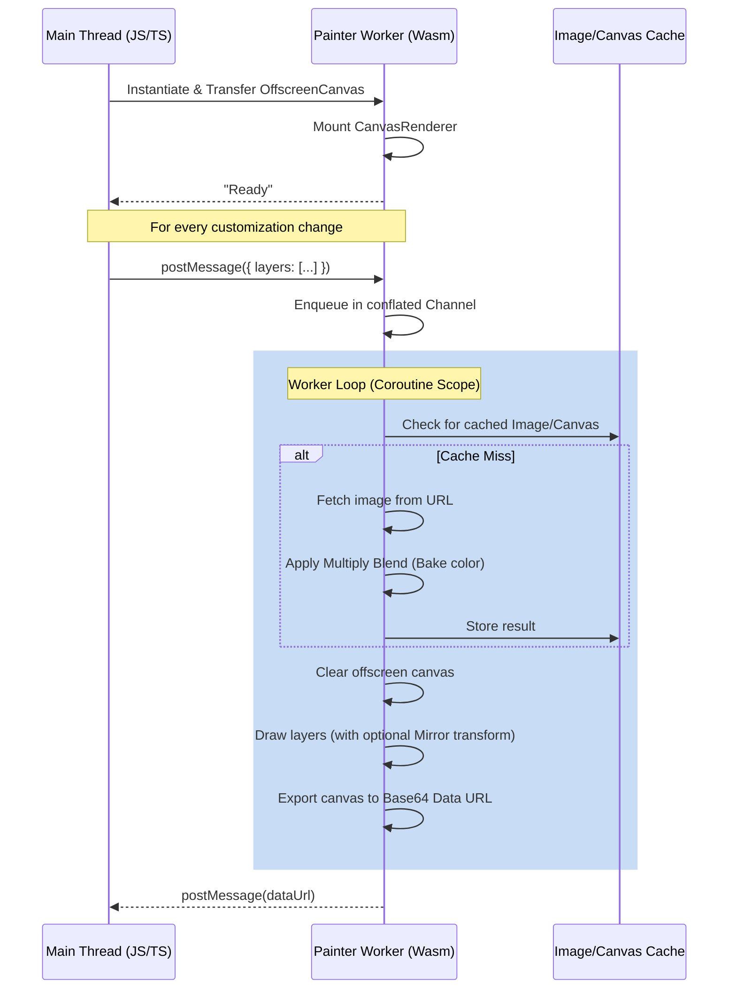

# Painter

A high-performance, WebAssembly-powered image layer compositor and color customizer. Built using Kotlin Multiplatform targeting `wasmJs`, Painter runs inside a Dedicated Web Worker to offload image decoding, color baking (tinting), and canvas rendering from the browser's main thread onto an `OffscreenCanvas`.

---

## Features

- 🧵 **Multi-Threaded Rendering**: Offloads CPU-intensive graphics operations to a Web Worker, ensuring a smooth 60fps UI on the main thread.
- 🎨 **Color Customization Engine**: Applies high-performance grayscale-intensity multiply blending to colorize/tint individual layers dynamically in real time.
- 🔄 **Horizontal Mirroring**: Supports independent horizontal flipping of layers via 2D canvas transforms.
- ⚡ **Conflated Rendering Queue**: Uses Kotlin coroutines and a conflated channel to automatically drop intermediate stale frames if rendering requests arrive faster than they can be processed.
- 💾 **Two-Tier Caching**: Caches raw downloaded images as `ImageBitmap`s and color-baked results as `OffscreenCanvas` layers to avoid redundant network calls and pixel manipulation.
- 📦 **TS Definitions**: Generates TypeScript declaration files (`.d.ts`) out-of-the-box for type-safe frontend integration.

---

## Architecture

Painter compiles into a WebAssembly binary and a JavaScript wrapper script. The main browser thread communicates with the Web Worker using message passing:



---

## JavaScript / TypeScript Integration

### 1. Spawning the Worker

Instantiate the compiled Painter script as a module-based Web Worker:

```javascript
// Path to the compiled JavaScript wrapper generated by Kotlin/WasmJS compiler
const painterWorker = new Worker('./painter.js');
```

### 2. Initializing the Canvas

To prevent initialization races, you must wait for the Web Worker to send the `"Ready"` message before posting and transferring the `OffscreenCanvas`.

```javascript
painterWorker.addEventListener('message', (event) => {
  if (event.data === 'Ready') {
    // The worker is ready. It is now safe to transfer the canvas control.
    const canvasElement = document.getElementById('avatar-canvas');
    const offscreen = canvasElement.transferControlToOffscreen();

    painterWorker.postMessage({
      canvas: offscreen,
      width: 512,
      height: 512
    }, [offscreen]); // Canvas is passed as a Transferable object
  } else {
    // Handle rendered output (see step 4)
    const renderedDataUrl = event.data;
    document.getElementById('avatar-preview').src = renderedDataUrl;
  }
});
```

### 3. Submitting Layers to Render

Send a payload containing the layers to render. The worker will draw them in the order they are listed (bottom to top).

```javascript
painterWorker.postMessage({
  layers: [
    { 
      url: 'https://example.com/assets/body.png', 
      hex: null, // No color customization (renders original colors)
      mirrored: false 
    },
    { 
      url: 'https://example.com/assets/shirt_grayscale.png', 
      hex: '#ff5733', // Custom color multiplication
      mirrored: false 
    },
    { 
      url: 'https://example.com/assets/hair_grayscale.png', 
      hex: '#4A2E80', // Custom color multiplication
      mirrored: true  // Flips hair horizontally
    }
  ]
});
```

### 4. Receiving the Rendered Image

The worker compiles the layers and posts the resulting base64-encoded Data URL of the composite image. As shown in the message listener setup (step 2), you can capture this Data URL and assign it directly to an image element:

```javascript
// Example listener showing output handler
painterWorker.addEventListener('message', (event) => {
  if (event.data === 'Ready') {
    // Handle ready state / canvas transfer
  } else {
    const renderedDataUrl = event.data;
    document.getElementById('avatar-preview').src = renderedDataUrl;
  }
});
```

---

## How Color Customization Works

Color customization is achieved using a **multiply blend operation** based on image intensity:

1. The library fetches the target image and loads it as an `ImageBitmap`.
2. A separate offscreen canvas of the target dimensions is created.
3. The original bitmap is drawn onto it to access raw pixel data via `getImageData`.
4. The grayscale intensity of each pixel is calculated:
   $$\text{intensityScale} = \frac{\text{intensity of R channel}}{255.0}$$
5. The pixel channels are replaced by multiplying the custom RGB components by the intensity scale:
   $$R_{\text{new}} = R_{\text{custom}} \times \text{intensityScale}$$
   $$G_{\text{new}} = G_{\text{custom}} \times \text{intensityScale}$$
   $$B_{\text{new}} = B_{\text{custom}} \times \text{intensityScale}$$
6. Transparent pixels (Alpha = 0) are kept untouched.
7. The modified image data is written back to the canvas, cached, and reused.

---

## Build & Test Instructions

### Compiling WebAssembly Target
Compile the project to WasmJs target (this runs the Kotlin to WebAssembly compiler):
```shell
./gradlew compileKotlinWasmJs
```

### Running Tests
Execute unit tests targetting WasmJs in a headless browser environment:
```shell
./gradlew wasmJsBrowserTest
```
