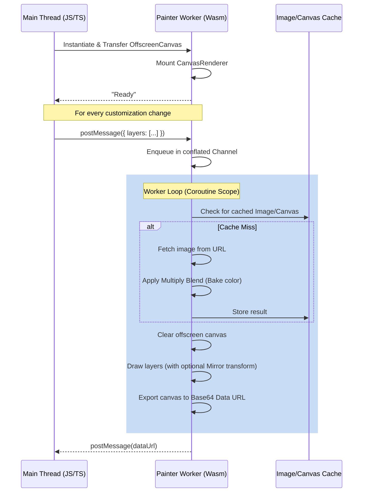

# Painter

A high-performance, WebAssembly-powered image layer compositor and color customizer. Built using Kotlin Multiplatform targeting `wasmJs`, Painter runs inside a Dedicated Web Worker to offload image decoding, color baking (tinting), and canvas rendering from the browser's main thread onto an `OffscreenCanvas`.

---

## Features

- 🧵 **Multi-Threaded Rendering**: Offloads CPU-intensive graphics operations to a Web Worker, ensuring a smooth 60fps UI on the main thread.
- 🎨 **Color Customization Engine**: Applies high-performance grayscale-intensity multiply blending to colorize/tint individual layers dynamically in real time.
- 🔄 **Horizontal Mirroring**: Supports independent horizontal flipping of layers via 2D canvas transforms.
- ⚡ **Conflated Rendering Queue**: Uses Kotlin coroutines and a conflated channel to automatically drop intermediate stale frames if rendering requests arrive faster than they can be processed.
- 💾 **Two-Tier Caching**: Caches raw downloaded images as `ImageBitmap`s and color-baked results as `OffscreenCanvas` layers to avoid redundant network calls and pixel manipulation.
- 📦 **TS Definitions**: Generates TypeScript declaration files (`.d.ts`) out-of-the-box for type-safe frontend integration.

---

## Architecture

Painter compiles into a WebAssembly binary and a JavaScript wrapper script. The main browser thread communicates with the Web Worker using message passing:



---

## JavaScript / TypeScript Integration

### 1. Spawning the Worker

Instantiate the compiled Painter script as a module-based Web Worker:

```javascript
// Path to the compiled JavaScript wrapper generated by Kotlin/WasmJS compiler
const painterWorker = new Worker(new URL('./painter.js', import.meta.url), {
  type: 'module'
});
```

### 2. Initializing the Canvas

Transfer control of an HTML `<canvas>` element to the Web Worker. This only needs to be done once:

```javascript
const canvasElement = document.getElementById('avatar-canvas');
const offscreen = canvasElement.transferControlToOffscreen();

painterWorker.postMessage({
  canvas: offscreen,
  width: 512,
  height: 512
}, [offscreen]); // Canvas is passed as a Transferable object
```

### 3. Submitting Layers to Render

Send a payload containing the layers to render. The worker will draw them in the order they are listed (bottom to top).

```javascript
painterWorker.postMessage({
  layers: [
    { 
      url: 'https://example.com/assets/body.png', 
      hex: null, // No color customization (renders original colors)
      mirrored: false 
    },
    { 
      url: 'https://example.com/assets/shirt_grayscale.png', 
      hex: '#ff5733', // Custom color multiplication
      mirrored: false 
    },
    { 
      url: 'https://example.com/assets/hair_grayscale.png', 
      hex: '#4A2E80', // Custom color multiplication
      mirrored: true  // Flips hair horizontally
    }
  ]
});
```

### 4. Receiving the Rendered Image

Listen for messages from the worker. The worker posts `"Ready"` when initialization is complete, and the base64-encoded Data URL of the composite image when rendering finishes.

```javascript
painterWorker.onmessage = (event) => {
  if (event.data === 'Ready') {
    console.log('Painter Web Worker is loaded and ready.');
  } else {
    const renderedDataUrl = event.data;
    
    // You can set it directly as an image source or save it:
    document.getElementById('avatar-preview').src = renderedDataUrl;
  }
};
```

---

## How Color Customization Works

Color customization is achieved using a **multiply blend operation** based on image intensity:

1. The library fetches the target image and loads it as an `ImageBitmap`.
2. A separate offscreen canvas of the target dimensions is created.
3. The original bitmap is drawn onto it to access raw pixel data via `getImageData`.
4. The grayscale intensity of each pixel is calculated:
   $$\text{intensityScale} = \frac{\text{intensity of R channel}}{255.0}$$
5. The pixel channels are replaced by multiplying the custom RGB components by the intensity scale:
   $$R_{\text{new}} = R_{\text{custom}} \times \text{intensityScale}$$
   $$G_{\text{new}} = G_{\text{custom}} \times \text{intensityScale}$$
   $$B_{\text{new}} = B_{\text{custom}} \times \text{intensityScale}$$
6. Transparent pixels (Alpha = 0) are kept untouched.
7. The modified image data is written back to the canvas, cached, and reused.

---

## API Reference (Kotlin classes)

### [RGB](file:///Users/jessecorbett/Projects/painter/src/wasmJsMain/kotlin/com/jessecorbett/painter/RGB.kt)
A simple data model representing a color.
- `r: Int`: Red intensity (0-255)
- `g: Int`: Green intensity (0-255)
- `b: Int`: Blue intensity (0-255)

### [Layer](file:///Users/jessecorbett/Projects/painter/src/wasmJsMain/kotlin/com/jessecorbett/painter/Layer.kt)
Kotlin model describing an individual layer configuration.
- `url: String`: Image resource location.
- `hex: String?`: Optional hex color string to apply (e.g. `"#FF5733"`).
- `mirrored: Boolean`: Whether to flip this layer horizontally.

### [CanvasRenderer](file:///Users/jessecorbett/Projects/painter/src/wasmJsMain/kotlin/com/jessecorbett/painter/CanvasRenderer.kt)
The core rendering coordinator.
- `suspend fun render(layers: List<Layer>)`: Performs the asynchronous rendering cycle.
- `suspend fun getDataUrl(): String`: Returns the base64-encoded Data URL of the canvas content.

### [Painter.kt](file:///Users/jessecorbett/Projects/painter/src/wasmJsMain/kotlin/com/jessecorbett/painter/Painter.kt)
Contains the main function of the Web Worker:
- **`PainterMessage`**: JavaScript interface for messages sent from the main thread.
- **`PainterLayer`**: JavaScript interface for individual layer configurations.

---

## Build & Test Instructions

### Prerequisites
- [Node.js](https://nodejs.org/en/download) (for runtimes/package manager).
- JDK 17 or higher.

### Compiling WebAssembly Target
Compile the project to WasmJs target (this runs the Kotlin to WebAssembly compiler):
```shell
./gradlew compileKotlinWasmJs
```

### Running Tests
Execute unit tests targetting WasmJs in a headless browser environment:
```shell
./gradlew wasmJsBrowserTest
```